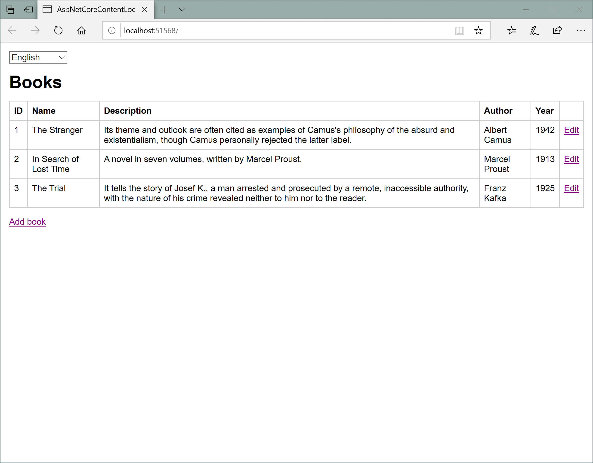
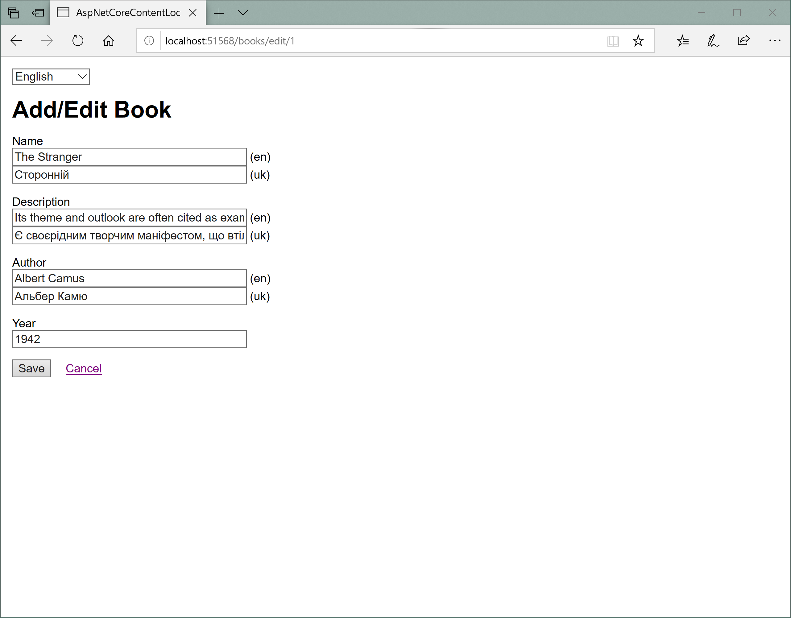

# ASP.NET Core: How to Store, Display, and Edit Localizable and Multilingual User Content
This is a demo web application for the
“[ASP.NET Core: How to Store, Display, and Edit Localizable and Multilingual User Content](https://medium.com/@dmitry.a.sikorsky/asp-net-core-how-to-store-display-and-edit-localizable-and-multilingual-user-content-9e5df1ae1b94)”
post on the [Dmitry Sikorsky’s blog](https://medium.com/@dmitry.a.sikorsky).
It demonstrates how to store, display, and edit localizable and multilingual user content.

The result looks like this:

*ASP.NET Core: How to Store, Display, and Edit Localizable and Multilingual User Content, Book List*

*ASP.NET Core: How to Store, Display, and Edit Localizable and Multilingual User Content, Add/Edit Book*

## Using the Application

1. Run the application.
2. Click Add book link. Fill the form. Click Save button.
3. Change culture in the culture selector.